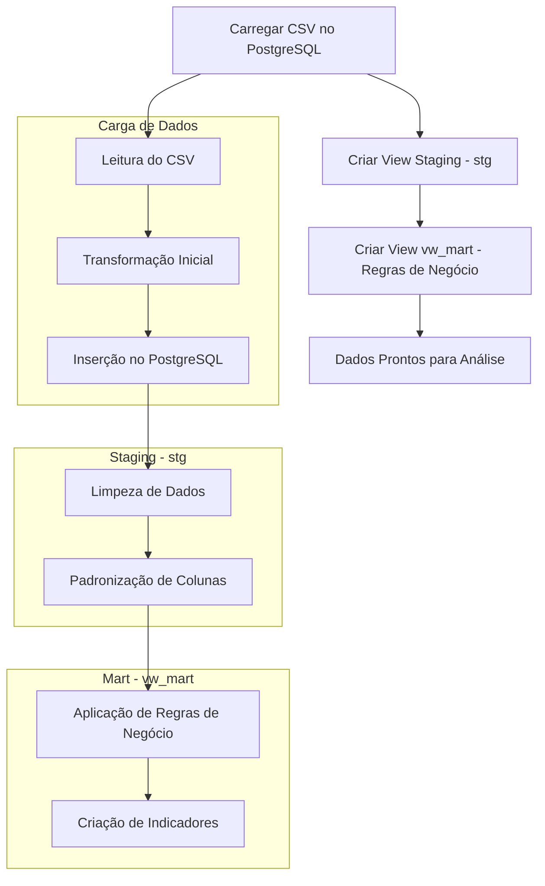

# Documentação Data Warehouse

## Projeto DBT-Core para Data Warehouse de Atenção Básica no Município

Este projeto utiliza **DBT (Data Build Tool)** para gerenciar e transformar dados de um **Data Warehouse (DW)** voltado para a Atenção Básica no Município. O objetivo é criar um **pipeline de dados robusto e eficiente** para tratar e organizar os dados relacionados à saúde básica, como **planos de saúde e movimentações dos pacientes**, facilitando a análise e a geração de insights.

---

## Estrutura do Projeto

### Fluxo do Processo ETL

O diagrama abaixo representa o fluxo de **Extração, Transformação e Carga (ETL)** dos dados de planos de saúde.



---

## Processamento e Redução de Linhas

O projeto inicia com **901.944** linhas de dados extraídas dos arquivos CSV. Após a aplicação das transformações e regras de negócio no **DBT**, os dados são refinados para facilitar a análise e a extração de insights.

---

## Tecnologias Utilizadas

- **DBT (Data Build Tool)**: Para modelagem e transformação dos dados.
- **PostgreSQL**: Banco de dados para armazenar e processar os dados.
- **CSV**: Fonte inicial dos dados.
- **Mermaid.js**: Para visualização do fluxo ETL no README.

---

## Como Executar o Projeto

1. **Instalar dependências**:
   ```sh
   dbt deps
   ```
2. **Executar as transformações**:
   ```sh
   dbt run
   ```
3. **Verificar a qualidade dos dados**:
   ```sh
   dbt test
   ```
4. **Gerar documentação do projeto**:
   ```sh
   dbt docs generate
   ```

---

## Contribuições

Sinta-se à vontade para contribuir com este projeto! Abra um **issue** ou envie um **pull request** com melhorias.

---

## Autor

Desenvolvido por **Bruno Silveira Corrêa**.
